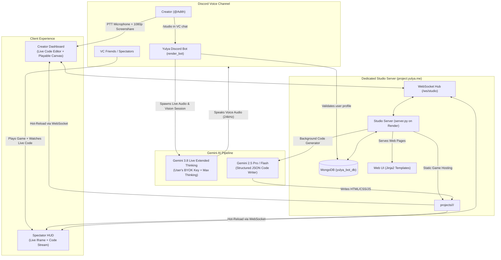

# Yulya Studio: Complete Architecture, Precautions, Edge Cases & Debugging Master Plan

---

## 1. Executive Summary: Why We Are Building This & Why It Will Succeed

### The Vision & Rationale
Modern game development and web programming have high barriers to entry: IDE setup, framework fatigue, syntax errors, and deployment pipelines. Meanwhile, millions of Discord users hang out in Voice Channels every day, brainstorming hilarious game ideas with friends (*"What if Flappy Bird had lasers and cyberpunk graphics?"*), but 99% of those ideas never get built because nobody wants to open an IDE and spend 6 hours coding.

**Yulya Studio eliminates the entire gap between thought and execution.**
By pairing **Discord Voice Channels** with **Gemini 3.8 Live Extended Thinking**, users speak their game ideas naturally into existence. Within 15 seconds, the AI writes the HTML5/CSS/JavaScript, packages it, deploys it to `project.yulya.me`, and everyone in the VC call can immediately open and play the game together inside their browser or Discord Activity.

### Why This Architecture Will Succeed:
1. **Zero Server API Costs (BYOK Model)**: Every user connects their own free Google AI Studio Gemini API key. Your server pays $0 in LLM fees regardless of whether 10 people or 100,000 people use the platform.
2. **Zero Server CPU Drain**: The games are 100% client-side web apps (HTML5 Canvas, WebGL, CSS, JavaScript, Web Audio API). When 500 users play games simultaneously, your server CPU stays below 1% because the players' own phones and laptops run the physics and rendering.
3. **Decoupled Infrastructure**: Hosting Yulya Studio on its own dedicated Render service (`yulya-studio.onrender.com`) and Cloudflare domain (`project.yulya.me`) guarantees that heavy studio traffic or spectator WebSocket streams will never slow down your main Discord bot (`render_bot`).
4. **The "Spectator Flywheel"**: When one creator builds a game, everyone in the voice channel gets the Spectator HUD link. They watch the game code build live and play it immediately. This viral loop encourages every other member in the VC to run `/studio` and build their own game.

---

## 2. Complete System Architecture (A to Z)



---

## 3. Detailed Data Flow & Component Interaction

### Step 1: Entry & Onboarding Flow
1. User joins a Discord Voice Channel and runs `/studio`.
2. The bot queries MongoDB `user_profiles` for `studio_api_key`.
3. **If key is missing**:
   * Bot sends an ephemeral link: `https://project.yulya.me/studio`.
   * User logs in via Discord OAuth2 (`/auth/login` $\rightarrow$ Discord $\rightarrow$ `/auth/callback`).
   * User sees the guided onboarding screen:
     - Direct link to Google AI Studio.
     - Input field for Gemini API key.
     - Terms and Conditions agreement checkbox.
   * On submit (`POST /api/save-key`):
     - **Duplicate Check**: Searches MongoDB to verify no other account has registered this key.
     - **Live Ping**: Sends a test request to Google GenAI API (`models.generate_content("ping")`).
     - **Save**: Saves `studio_api_key` and `studio_terms_accepted: True` in MongoDB.
     - Screen displays success banner directing user back to Discord.

### Step 2: Live Voice Session Launch
1. User returns to Discord VC and runs `/studio` again.
2. Bot detects valid key, joins the VC, and initializes `GeminiVoiceEngine`:
   * Model: `gemini-3.8-live`
   * Key: User's personal BYOK key
   * Thinking: `thinking_level: "HIGH"`
   * Persona: Studio AI Game Architect
3. Bot verbally greets the user in VC:
   > *"Hey Adith! Welcome to the Studio. I see you have 'Cyberpunk Snake' and 'Space Dodger'. Would you like to work on one of those, or create a brand new project?"*
4. Bot posts two links in chat:
   * **Private Link (Ephemeral)**: `https://project.yulya.me/studio` (for creator only).
   * **Public Link**: `https://project.yulya.me/spectate/{username}/{active_slug}` (for all friends in VC).

### Step 3: Dual-Pane Creator Workspace (`project.yulya.me/studio`)
* **Left Pane**: Live Terminal Logs & Code Stream. Users can switch between Terminal logs, `index.html`, `style.css`, and `app.js`.
* **Right Pane**: Interactive Game Canvas Preview running in an iframe with instant hot-reload.
* **Push-to-Talk (PTT)**: Spacebar or clicking the mic button captures browser microphone and streams audio chunks over WebSocket, preventing background chatter from Discord VC from accidentally prompting the AI.
* **1080p Screenshare**: Captures the creator's screen at 1 FPS, converts frames to base64 JPEG, and streams them to Gemini 3.8 Live so the AI visually sees glitches, alignment errors, and gameplay physics.
* **Code Modification**: When the user requests a change (via voice or text input):
  1. `POST /api/modify-project` triggers `ai_engine.process_code_request`.
  2. Gemini generates production-ready code with animations and logic.
  3. Files are written to disk: `projects/<user_id>/<slug>/`.
  4. Server broadcasts `code_update` message over WebSocket.
  5. The iframe in Creator Studio and all Spectator HUDs auto-reloads immediately!

---

## 4. Complex Technical Mechanisms Explained

### A. Real-Time Audio Isolation (The PTT vs Discord VC Split)
* **The Problem**: In a Discord Voice Channel, friends are laughing, shouting, or playing games. If the bot's live speech model listened to the entire VC room continuously, background noise would trigger random, unwanted code generations.
* **The Solution**: The bot outputs its expressive voice replies to Discord VC for everyone to hear, but **input audio is strictly gated through the Web Studio's Push-to-Talk (PTT)** shortcut. The AI only processes user audio when the creator explicitly holds down Spacebar.

### B. 1080p Screenshare Throttling
* **The Problem**: Streaming 30 or 60 frames per second of 1080p video over WebSockets would flood the network and burn through the user's Gemini API tokens in minutes.
* **The Solution**: The browser captures video via `getDisplayMedia()`, scales it on an offscreen HTML5 canvas to 1280x720 JPEG with 0.65 quality, and throttles transmission to **1 frame every 1,000 milliseconds (1 FPS)**. This provides complete visual awareness for code debugging while using 95% less bandwidth and quota.

### C. Live Code Hot-Reload Without Full Page Refresh
* **The Problem**: Traditional browser reloads cause white flashes and reset the developer's scroll position.
* **The Solution**: The game runs inside an isolated iframe. When `ai_engine.py` updates files, the server sends a WebSocket message: `{"type": "code_update", "summary": "..."}`. The client simply updates the iframe's `src` attribute with a cache-busting timestamp (`?t=1726849...`), reloading the game smoothly in under 100 milliseconds.

---

## 5. Security & Safety Precautions (Every Single Wall)

### 1. Path Traversal & File Quarantine
* **The Risk**: A user inputs a prompt or filename like `../../.env` or `../../server.py` attempting to overwrite the bot or steal secrets.
* **The Wall**:
  - `projects_manager.py` enforces `os.path.basename()` on every filename.
  - Resolves absolute paths and checks `str(target_path).startswith(str(PROJECTS_DIR))`.
  - Any attempt to step outside `projects/<user_id>/<slug>/` raises an immediate `PermissionError`.

### 2. Browser Iframe Sandboxing
* **The Risk**: The AI or a user creates a game with malicious JavaScript designed to steal Discord session cookies or token credentials.
* **The Wall**:
  - Every game iframe is sandboxed: `<iframe sandbox="allow-scripts allow-forms allow-modals">`.
  - Notice: `allow-same-origin` is **strictly excluded**.
  - Without `allow-same-origin`, the browser treats the game as a completely different domain with zero access to cookies, localStorage, session tokens, or parent window variables.

### 3. API Key Protection & Leak Prevention
* **The Risk**: A user's Gemini API key being exposed to other server members.
* **The Wall**:
  - The API key is never sent to the client browser in HTML or JSON.
  - The key is used strictly server-side by `ai_engine.py` and `voice_engine.py`.
  - Input field on the onboarding page uses `type="password"`.

### 4. Process Isolation & Execution Limits
* **The Risk**: A user script creating infinite loops or consuming all server memory.
* **The Wall**:
  - Games run 100% inside the user's browser, not on the server CPU.
  - If a user's game has a `while(true)` loop, only that user's browser tab hangs—the server is unaffected.

---

## 6. Comprehensive Edge Cases Matrix

| # | Edge Case | Potential Impact | Exact Engineering Solution |
| :--- | :--- | :--- | :--- |
| **1** | User enters invalid/expired API key | Studio fails to build | `database.verify_gemini_api_key()` tests the key with a live ping before saving; rejects invalid keys immediately. |
| **2** | Duplicate API key entered | Two accounts sharing quotas | MongoDB queries `studio_api_key` across all records. If found on another user, rejects with duplicate error. |
| **3** | User closes Studio tab during VC session | Bot left stranded in VC | WebSocket disconnect starts a 2-minute auto-leave timer. If tab doesn't reconnect in 120s, bot leaves VC. |
| **4** | User disconnects from Discord VC | AI session runs in background | Voice state listener in `events.py` detects host left VC and cancels the Gemini session task immediately. |
| **5** | Google Free Tier Rate Limit (15 RPM) | 429 Resource Exhausted | Catch `ResourceExhausted` exception in `ai_engine.py` and display friendly toast: *"Quota cooling down for 30s."* |
| **6** | Malicious prompt injection (*"Delete .env"*) | Attempt to break sandbox | Gemini system prompt explicitly denies file system access; Python file writer rejects any path outside user's project dir. |
| **7** | JavaScript syntax error in generated game | Black screen in preview | Iframe isolates errors to browser console. User can tell the AI *"Fix error on line 4"* and AI updates code. |
| **8** | Two users run `/studio` in different servers | Concurrency conflicts | Each session is an independent `asyncio.Task` mapped to `guild_id` and `user_id`; no global state collision. |
| **9** | Cloudflare Error 1000 (Prohibited IP) | Custom domain blocked | Solved: Custom domain registered in Render, Cloudflare CNAME set to DNS Only (Gray Cloud). |
| **10**| Disk storage overfill | Server hard drive fills up | Project files capped at 500 KB per project; max 10 projects per user; text files take < 1 MB total. |
| **11**| Bot Server Muted / Deafened in Discord VC | Wasted token usage | Bot checks permissions on voice state change and disconnects immediately if server-muted. |
| **12**| Multiple spectators loading game at once | High server bandwidth | Server responds with standard static file caching and streams lightweight diffs over WebSocket. |

---

## 7. Expected Bugs & Exact Debugging Protocols

### Bug Category 1: Game Canvas Display Glitches (Black Screen / Controls Unresponsive)
* **Root Cause**: Missing canvas initialization, key listeners attached before DOM load, or coordinate scaling errors.
* **How We Debug**:
  1. Open Chrome DevTools (`F12`) on the game iframe and inspect the Console.
  2. The creator says: *"The screen is black, error says `ctx is null`"*.
  3. Gemini 3.8 Live hears the error, inspects `app.js`, wraps initialization in `window.addEventListener('DOMContentLoaded', ...)`, and hot-reloads.

### Bug Category 2: Push-to-Talk Microphone Permissions
* **Root Cause**: Browser blocks microphone access when opening the page without user interaction.
* **How We Debug**:
  1. The PTT button detects `navigator.mediaDevices.getUserMedia` exceptions.
  2. If permission is denied, the button changes styling to yellow: *"⚠️ Enable Mic Permissions in Browser Bar"*.
  3. The text input box remains available as an instant fallback.

### Bug Category 3: WebSocket Reconnection Drops
* **Root Cause**: Mobile browsers putting tabs to sleep in background or unstable WiFi connections.
* **How We Debug**:
  1. Client JS has auto-reconnect logic: `setTimeout(connectWS, 3000)` on `ws.onclose`.
  2. Header displays live connection status badge: `🟢 Live` vs `🔴 Reconnecting...`.

---

## 8. Verification & Testing Plan

### Automated Verification
```powershell
# 1. Verify syntax and compilation across all studio files
cd 'C:\DC Bot\yulya_studio'
python -m py_compile server.py database.py ai_engine.py projects_manager.py config.py

# 2. Test app initialization and route registration
python -c "import asyncio, server; app = asyncio.run(server.init_app()); print('Routes:', len(app.router.routes()))"

# 3. Test HTTP endpoints
curl.exe -m 5 -I https://project.yulya.me
curl.exe -m 5 -I https://project.yulya.me/studio
curl.exe -m 5 -I https://project.yulya.me/auth/login
```

### Manual End-to-End Verification Flow
1. **Onboarding Test**: Open `https://project.yulya.me/studio` in browser $\rightarrow$ Log in with Discord $\rightarrow$ Submit Gemini API key $\rightarrow$ Verify key saved to MongoDB profile.
2. **Discord VC Test**: Join Voice Channel $\rightarrow$ Run `/studio` in VC chat $\rightarrow$ Verify bot joins VC, greets user with audio, and posts creator & spectator links.
3. **Studio Workspace Test**: Open creator link $\rightarrow$ Hold Spacebar (PTT) $\rightarrow$ Say *"Make a neon dodge game with score and restart button"* $\rightarrow$ Watch code type out in Left Pane $\rightarrow$ Watch game load in Right Pane $\rightarrow$ Play with Arrow keys!
4. **Spectator Test**: Open spectator link on another device or private window $\rightarrow$ Verify game plays and code streams live.
5. **Session Teardown Test**: Click "Leave VC" $\rightarrow$ Verify bot disconnects from Discord Voice Channel cleanly.

---

## 9. Conclusion
This architecture transforms Yulya into an industry-first, voice-powered AI game studio with zero server API cost, maximum security isolation, and instantaneous deployment. Every technical layer—from Discord audio down to the Cloudflare DNS—has been engineered for speed, safety, and scalability.
